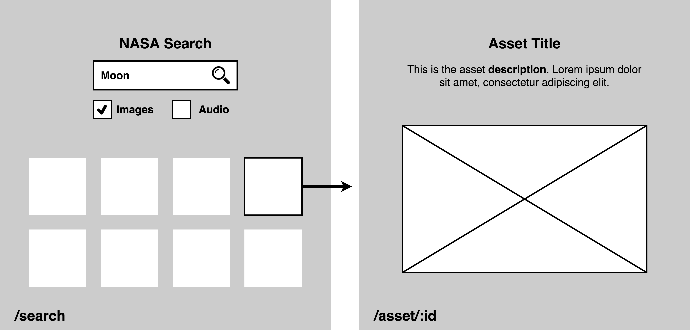

# Nasa Image and Audio Library (Front End Technical Challenge)

## Brief

Develop a web application that integrates with the [NASA Image and Video Library API](https://images.nasa.gov/). It should allow users to **search for assets** and then **select and view an asset**.

The following wireframes show a high-level representation of the content and user flow:

### Docs

- https://images.nasa.gov/docs/images.nasa.gov_api_docs.pdf
- https://images.nasa.gov (website)

## Tools, libraries and frameworks used

- Create React App (ReactJS 17 + Typescript 4.5)
- React Router v6
- MUI v5 (formerly Material-UI, which use Emotion as CSS-in-JS solution)
- @testing-library + Jest

## Pending improvements

- Fix the test cases that are failing (possibly related with the v6 of React Router).
- Create a MUI theme for the project and add Animation.
- Pagination (using the "page" param in the search endpoint of the Nasa API).
- Check Accessibility.
- Add a player in the multimedia assets (audio/video).
- CI (Github Actions).

## Create React App Available Scripts

In the project directory, you can run:

### `npm start`

Runs the app in the development mode.\
Open [http://localhost:3000](http://localhost:3000) to view it in the browser.

The page will reload if you make edits.\
You will also see any lint errors in the console.

### `npm test`

Launches the test runner in the interactive watch mode.\
See the section about [running tests](https://facebook.github.io/create-react-app/docs/running-tests) for more information.

### `npm run build`

Builds the app for production to the `build` folder.\
It correctly bundles React in production mode and optimizes the build for the best performance.

The build is minified and the filenames include the hashes.\
Your app is ready to be deployed!

See the section about [deployment](https://facebook.github.io/create-react-app/docs/deployment) for more information.